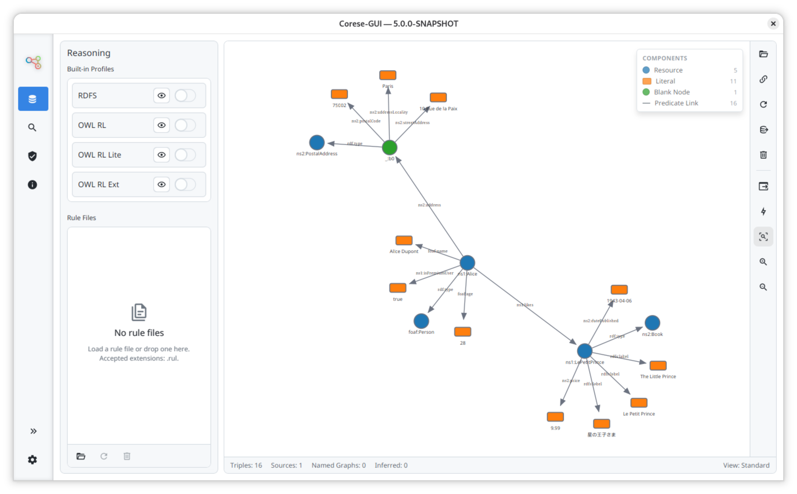
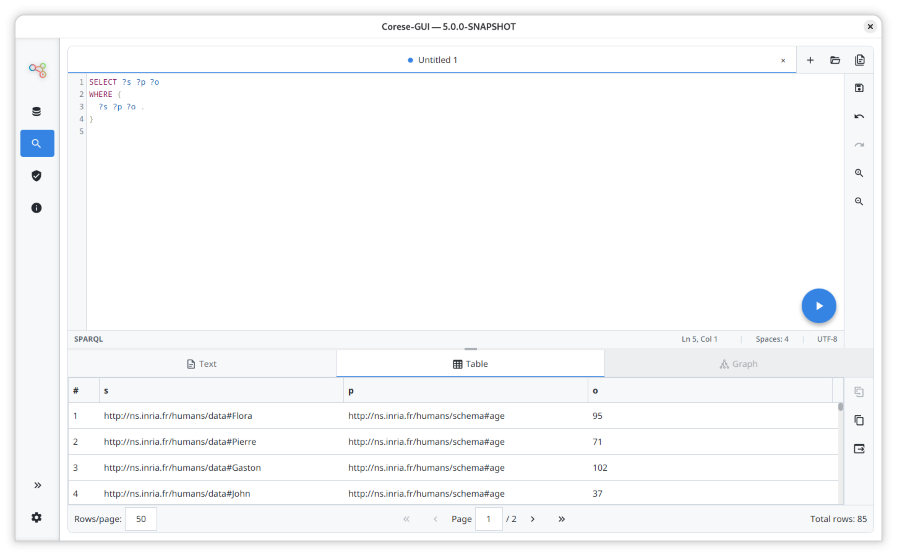
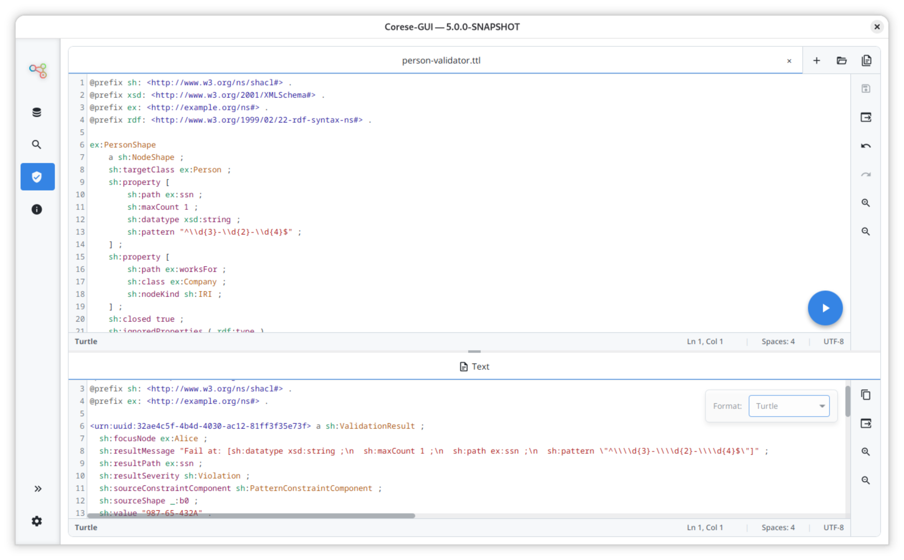
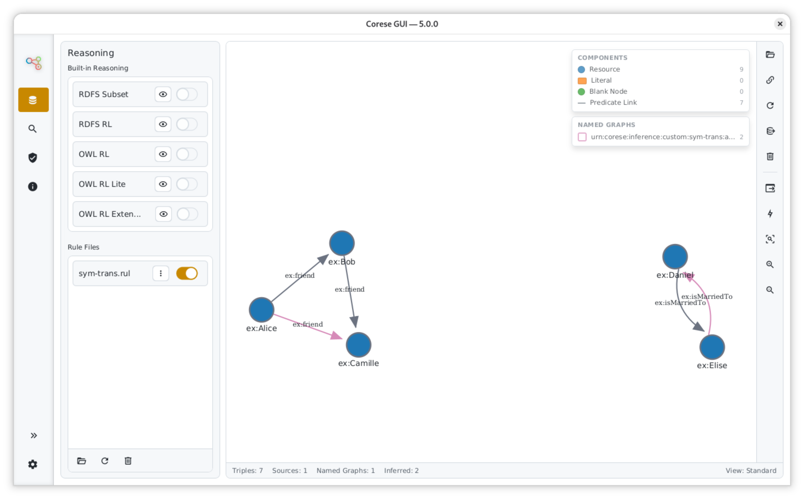

<!-- markdownlint-disable MD033 -->
<!-- markdownlint-disable MD041 -->

<p align="center">
  <a href="https://project.inria.fr/corese/">
    
  </a>
  <br>
  <strong>Graphical User Interface for the Semantic Web of Linked Data</strong>
</p>

<p align="center">
  <a href="https://cecill.info/licences/Licence_CeCILL-C_V1-en.html"></a>
  <a href="https://github.com/orgs/corese-stack/discussions"></a>
  <a href="https://corese-stack.github.io/corese-gui/"></a>
</p>

# Corese-GUI

Corese-GUI is the desktop application of the Corese Semantic Web stack.
It provides a visual workspace to load RDF data, execute SPARQL queries, inspect results, validate SHACL constraints, and run reasoning workflows.

## Features

- Load and explore RDF datasets
- Execute SPARQL queries (SELECT, CONSTRUCT, ASK, UPDATE)
- Visualize graph results
- Validate data with SHACL
- Apply reasoning with built-in and custom rules
- Manage data, query, validation, logs, and settings from dedicated views

<p align="center">
  
  
</p>
<p align="center">
  
  
</p>

## Downloads

### Windows

- [Installer (recommended, x64, .exe)](https://github.com/corese-stack/corese-gui/releases/download/v5.0.0/corese-gui-5.0.0-windows-x64.exe)
- [Portable archive (x64, .zip)](https://github.com/corese-stack/corese-gui/releases/download/v5.0.0/corese-gui-5.0.0-windows-x64-portable.zip)
- [Standalone JAR (x64)](https://github.com/corese-stack/corese-gui/releases/download/v5.0.0/corese-gui-5.0.0-standalone-windows-x64.jar)

### macOS

- [Installer for Apple Silicon (arm64, .dmg)](https://github.com/corese-stack/corese-gui/releases/download/v5.0.0/corese-gui-5.0.0-macos-arm64.dmg)
- [Installer for Intel (x64, .dmg)](https://github.com/corese-stack/corese-gui/releases/download/v5.0.0/corese-gui-5.0.0-macos-x64.dmg)
- [Standalone JAR for Apple Silicon (arm64)](https://github.com/corese-stack/corese-gui/releases/download/v5.0.0/corese-gui-5.0.0-standalone-macos-arm64.jar)
- [Standalone JAR for Intel (x64)](https://github.com/corese-stack/corese-gui/releases/download/v5.0.0/corese-gui-5.0.0-standalone-macos-x64.jar)

### Linux

- [Flatpak (recommended)](https://flathub.org/apps/fr.inria.corese.CoreseGui)
- [App archive (x64, .tar.gz)](https://github.com/corese-stack/corese-gui/releases/download/v5.0.0/corese-gui-linux-x64.tar.gz)
- [App archive (arm64, .tar.gz)](https://github.com/corese-stack/corese-gui/releases/download/v5.0.0/corese-gui-linux-arm64.tar.gz)
- [Standalone JAR (x64)](https://github.com/corese-stack/corese-gui/releases/download/v5.0.0/corese-gui-5.0.0-standalone-linux-x64.jar)
- [Standalone JAR (arm64)](https://github.com/corese-stack/corese-gui/releases/download/v5.0.0/corese-gui-5.0.0-standalone-linux-arm64.jar)

> Standalone JAR files require Java 25 to be installed manually.

## Build and Run (local)

```bash
./gradlew clean check
./gradlew run
```

Linux dead-key fallback is enabled by default. Disable it only if needed:

```bash
CORESE_IM_BOOTSTRAP_MODE=off ./gradlew run
# or
CORESE_IM_BOOTSTRAP_DISABLE=1 ./gradlew run
```

Build artifacts for the current platform:

```bash
./gradlew packageCurrentPlatform
```

## Documentation

- [Documentation site](https://corese-stack.github.io/corese-gui)

## Contributing

- [Discussions](https://github.com/orgs/corese-stack/discussions)
- [Issues](https://github.com/corese-stack/corese-gui/issues)
- [Pull Requests](https://github.com/corese-stack/corese-gui/pulls)
